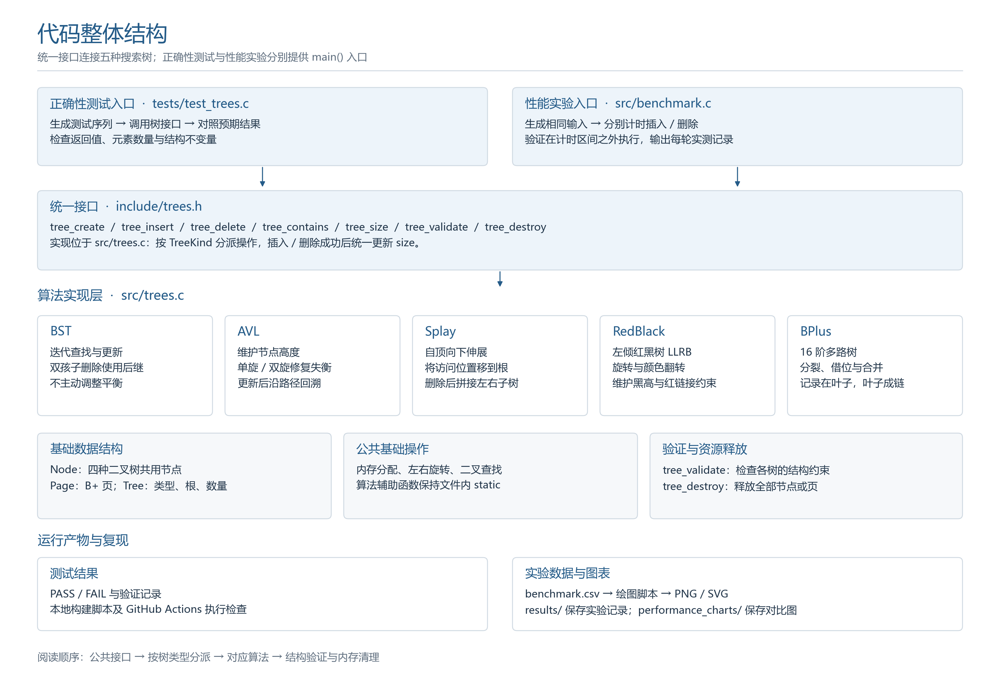
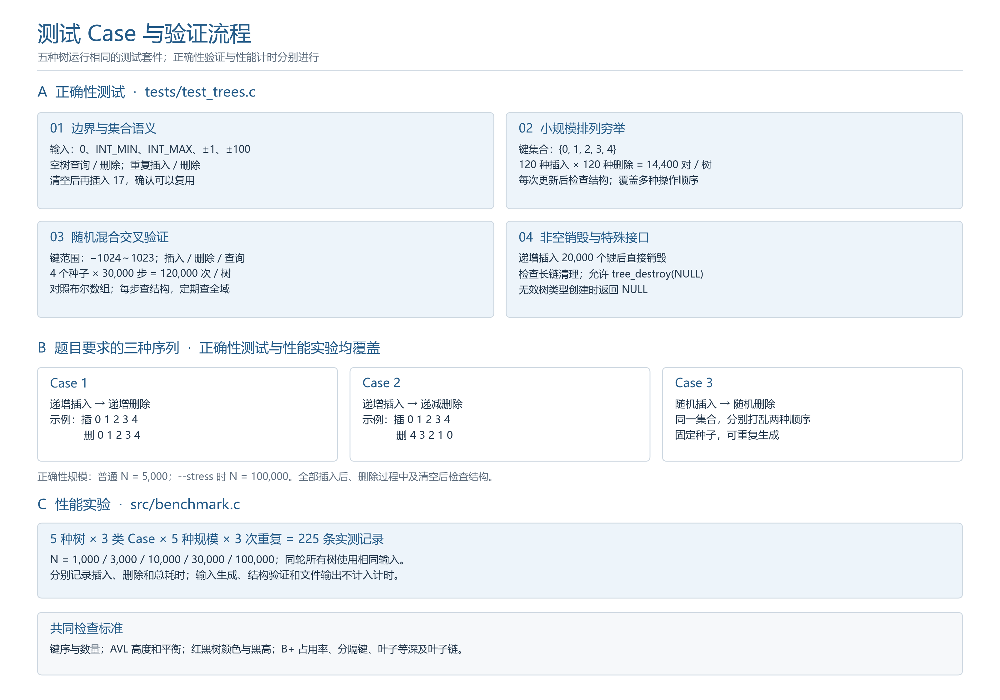

# ADS-P1-CompareSearchTrees

本仓库用于小组协作完成 **搜索树实现与性能比较** 课程项目，统一管理代码、测试、实验数据、图表及报告材料。

当前已提供五种搜索树的 C 语言实现、自动化测试和性能实验工具。后续小组成员可在此基础上共同完善实现、分析实验结果并撰写项目报告。

## 代码结构与阅读顺序

项目采用算法库、独立正确性测试和独立性能实验程序的结构。`main()` 仅保留在 `tests/test_trees.c` 和 `src/benchmark.c` 两个可执行程序中。

算法集中在 `src/trees.c`，按以下十个明确分区组织，便于课程阅读与提交：

| 分区 | 职责 |
|---|---|
| 1. Data structures | 二叉节点、B+ 页、Tree 的数据结构及字段含义 |
| 2. Shared binary-tree primitives | 内存分配、旋转、普通二叉查找 |
| 3. Unbalanced BST | BST 定位、插入、删除 |
| 4. AVL tree | 高度维护、平衡修复、递归更新 |
| 5. Splay tree | 伸展、插入和删除后的子树拼接 |
| 6. Left-leaning red-black tree | 旋转、变色、插入、删除及根颜色处理 |
| 7. B+ tree | 页内操作、分裂、借位、合并和根变化 |
| 8. Public API and operation dispatch | 公共接口、按树类型分派、统一更新 size |
| 9. Structural validation | 各种树的不变量与数量检查 |
| 10. Memory cleanup | 释放二叉树和 B+ 页 |

建议先读 `include/trees.h` 了解接口，再读第 8 区的 `tree_insert()`、`tree_delete()`，最后进入感兴趣的树模块。公共接口使用清晰的 `switch`，每个分支只调用对应算法；具体的节点操作不再混在大型条件分支内。

例如 BST 的插入调用链为 `tree_insert → bst_insert → bst_find_slot/new_node`，成功后由 `tree_insert` 统一增加 size。B+ 的删除调用链为 `tree_delete → bplus_delete → bp_delete → repair_child`，页修复和根收缩分别在对应层完成。

所有算法函数保持文件内 `static`，外部仍只使用 `trees.h` 中的公共接口。BST、Splay 及 B+ 的包装函数负责结构变化；元素总数只由公共更新接口修改，避免重复计数。

## 实现范围

| 搜索树 | 实现选择 |
|---|---|
| 非平衡 BST | 迭代插入、删除、查询、销毁；不针对有序输入做捷径优化 |
| AVL | 高度维护、单旋与双旋、插入和删除后恢复平衡 |
| Splay | 自顶向下伸展；查找失败也进行伸展 |
| Red-black | 左倾红黑树（LLRB），属于红黑树的一种实现 |
| B+ | 16 阶：内部节点最多 16 个孩子，叶子最多 15 条记录，叶子链连接 |

统一接口位于 `include/trees.h`。集合接受完整 `int` 范围；重复插入与不存在的删除返回 `false`，不改变元素集合。有效树对象必须由 `tree_create` 创建；除 `tree_destroy(NULL)` 外，接口要求传入非空有效对象。内存不足打印错误并退出。底层算法和测试均为 C11；Python 用于辅助工具和绘图。实现覆盖课程要求的五种搜索树和三种插入、删除序列。

## Windows 编译与测试

需要 GCC（本地使用 MinGW-w64 GCC 14.2.0）和 PowerShell。

```powershell
./build.ps1 -Test
./build.ps1 -Stress
```

开启 `-std=c11 -Wall -Wextra -Wpedantic -Wconversion -Wshadow -Werror -O2`，警告按错误处理。`--stress` 对每种树执行 N=100000 的全部三种序列；普通测试使用 N=5000。非平衡 BST 的有序插入是 O(N²)，逆序删除也可能是 O(N²)，因此压力测试和完整基准需要等待。

正确性测试完整保存在独立文件 `tests/test_trees.c`，性能测试完整保存在独立文件 `src/benchmark.c`，均与 `src/trees.c` 分离。也可以直接编译测试：

```powershell
gcc -std=c11 -O2 -Wall -Wextra -Wpedantic -Werror -Iinclude src/trees.c tests/test_trees.c -o build/test_trees.exe
./build/test_trees.exe
```

首次复现先运行 `python -m pip install -r requirements.txt`，然后运行 `./run_experiments.ps1 -Stress`，一次完成编译、压力测试、完整性能实验和绘图。快速复现可用 `./run_experiments.ps1 -MaxN 1000 -Repeats 1`；不需要绘图时附加 `-SkipPlots`。每次运行会更新 `results/` 中同名数据和日志，需保留的旧结果请先复制。

Linux/macOS 可使用 `make test`、`make stress`。支持的 GCC/Clang 环境可运行 `make sanitize`；GitHub Actions 在 Linux 上执行 AddressSanitizer、UndefinedBehaviorSanitizer 和泄漏检测。不要把尚未执行的 CI 配置当作已经通过的测试结果。

## 正确性验证

- 空树、单节点、重复键、不存在的键、`INT_MIN`、`INT_MAX`、清空后复用。
- 每种树遍历 5 个键全部 120 种插入排列 × 120 种删除排列，共 14400 对排列，每步检查结构。
- 每种树 4 个固定种子、共 120000 次混合操作，与独立布尔数组集合对照；每次操作检查元素数和结构，定期逐键核对全域。
- 三种指定序列，以及非空退化树直接销毁。
- BST/Splay：严格键序和节点数；AVL：额外核对实际高度和平衡因子；红黑树：根黑、无红红边、黑高相等、左倾；B+：占用率、分隔键、所有叶子等深、叶子链和记录数。

## 可复现实验

```powershell
New-Item -ItemType Directory -Force results
./build/benchmark.exe --output results/benchmark.csv --repeats 3 --seed 20261003
python -m pip install -r requirements.txt
python tools/plot_results.py results/benchmark.csv --output-dir results
```

默认 N 为 1000、3000、10000、30000、100000。三个场景分别是递增插入/递增删除、递增插入/递减删除、随机插入/独立随机删除。每个场景都使用 0..N-1 的互异整数。相同 N、场景、重复轮次下，所有树使用完全相同的操作序列。Fisher–Yates 洗牌采用固定宽度 xorshift32 和拒绝采样；CSV 记录各轮种子，重复轮次间改变种子并轮换树的运行顺序。

计时器在 Windows 为 QueryPerformanceCounter，POSIX 为 CLOCK_MONOTONIC。分别计时全部插入、全部删除，同时记录二者之和。计时包含算法正常的节点分配/释放及操作返回值累计；不包含输入生成、结构验证、CSV 输出、最终树销毁。插入后的校验会访问节点、影响缓存状态，这是所有树一致采用的实验约定。没有额外预热；短耗时结果需要结合重复波动解释，不能作为硬件无关的结论。

CSV 字段：`tree,scenario,n,repeat,seed,insert_seconds,delete_seconds,total_seconds`。绘图脚本生成 `summary.csv` 和 PNG/SVG 九宫格曲线，行对应三种序列，列对应插入/删除/总时间；双对数坐标，中位数曲线与 min/max 阴影。原始测量不做拟合替换。小组成员分析结果或撰写报告时，可直接复用数据和图片，并参考 `results/VALIDATION.md` 中的实际运行环境与验证记录。

快速检查：`./build/benchmark.exe --max-n 1000 --repeats 1 --output build/smoke.csv`。`--max-n` 是默认规模列表的上界，不会额外创建新规模。

## 文件组织

- `src/trees.c`、`include/trees.h`：五种树及统一接口。
- `src/benchmark.c`：确定性实验输入与计时输出。
- `tests/test_trees.c`：正确性与压力测试。
- `tools/`：辅助工具与绘图；`results/`：共享实验数据、图表及验证记录。
- `.github/workflows/ci.yml`：持续编译、测试和内存检查。

## 独立性能对比图

[performance_charts](performance_charts/README.md) 单独保存三种 case 的插入、删除和总耗时对比图，共九张独立图和一张总览，均提供 PNG 与 SVG。采用现有实测数据的三次重复中位数；原始数据、绘图数值和复现方法也保存在该文件夹。

## 代码与测试说明图

代码结构图展示程序入口、统一接口、五种树实现及运行产物。



测试说明图展示正确性测试、三类操作序列和性能实验规模。



两张图均在 `project_diagrams/` 中提供 PNG 和 SVG，可用于小组讨论与报告。
